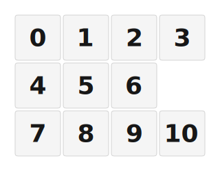

# VL03 — Numpad + Encoder Macropad

A hand‑wired **10‑key numpad with a rotary encoder**, powered by [ZMK](https://zmk.dev).
It works as a normal numpad *and* as a mini **stream deck** — flip to the second layer and
every key becomes an F13–F21 hotkey you can bind in OBS, Voicemeeter, or anything else.



```
  7   8   9   (◑ encoder)
  4   5   6
  1   2   3    0
```

> The encoder **rotates for volume** and you **press it to mute**.

---

## ✨ Features

- **10 keys + a clicky rotary encoder** (volume / mute).
- **Two layers** out of the box: a numpad and a row of F‑keys (great as a stream deck).
- **[ZMK Studio](https://zmk.dev/docs/features/studio) support** — change your layout live from a browser, no recompiling.
- **Board‑agnostic 3D‑printed case** — the controller bay accepts **both** the XIAO **and** the
  SuperMini footprints. Drop in a **Seeed XIAO** (nRF52840 / RP2040 / ESP32‑S3) **or** an
  **ESP32‑C3 / ESP32‑S3 SuperMini** — among other similar‑size boards. This prebuilt firmware
  targets the **Seeed XIAO nRF52840**.
- Fully open: the [keymap](config/vl03.keymap) is a plain text file you can edit and rebuild.

---

## 🧰 What you need to build one

- A small dev board (this prebuilt firmware is for the **Seeed XIAO nRF52840**).
- 10 mechanical switches + keycaps.
- 1 × **EC11 rotary encoder** (the kind with a push‑button shaft).
- 11 × **1N4148 diodes** (one per switch *and* one for the encoder's push‑button).
- Wire, a soldering iron, and the 3D‑printed case (below).
- A USB‑C cable.

> **New to keyboards?** A "matrix" just means the switches are wired in a grid of **rows**
> and **columns** so a handful of microcontroller pins can read many keys. Each switch needs
> a **diode** so the board can tell which keys are pressed when several are held at once.

---

## 🖨️ 3D‑printed case

The case is designed to be **controller‑agnostic** — print it once and drop in whichever
supported board you have.

➡️ **MakerWorld:** *(placeholder — add your MakerWorld link here)*

---

## 📺 Build video

A full step‑by‑step build walkthrough:

➡️ **YouTube:** *(placeholder — add your build video link here)*

---

## 🔌 Wiring (for the prebuilt firmware)

The firmware in this repo expects the following **XIAO nRF52840** pins (use the silkscreen
labels printed on the board: `D0`, `D3` …). If you wire it exactly like this, the prebuilt
firmware just works — **no compiling needed**.

| Role | XIAO pins |
| --- | --- |
| **Columns** (4) | `D0`, `D5`, `D7`, `D8` |
| **Rows** (3) | `D6`, `D9`, `D10` |
| **Encoder** A / B | `D3` / `D4` |
| **Encoder** common (middle pin) | `GND` |

### Which switch goes where

Each switch connects one **row** pin to one **column** pin (through its diode). The encoder's
push‑button is just another key in the matrix (top‑right corner).

|              | Col `D0` | Col `D5` | Col `D7` | Col `D8` |
| ------------ | :------: | :------: | :------: | :----------: |
| **Row `D6`**  |   `7`    |   `8`    |   `9`    | encoder push |
| **Row `D9`**  |   `4`    |   `5`    |   `6`    |      –       |
| **Row `D10`** |   `1`    |   `2`    |   `3`    |     `0`      |

### Diodes

This build uses a **`COL2ROW`** matrix. Wire each diode so it points **from the column to the
row** — the **stripe (cathode) faces the row** pin. The encoder's push‑button needs a diode
too, exactly like the keys.

> If about half your keys don't register, or pressing two keys triggers a third, your diodes
> are likely backwards — flip them.

### Encoder

A standard EC11 has 3 pins on one side (**A · C · B**) and 2 pins on the other (the push‑button):

- **A → `D3`**, **B → `D4`**, **C (middle) → `GND`**
- The 2 push‑button pins go into the **matrix** at the top‑right slot (Row `D6` ↔ Col `D8`, with a diode).

---

## ⬇️ Flashing the prebuilt firmware

1. Download the latest **`vl03`** firmware (a `.uf2` file) from this repo's **Actions** tab →
   newest run → **Artifacts**. (See the [ZMK guide](https://zmk.dev/docs/user-setup#installing-the-firmware) if you get stuck.)
2. Plug the numpad into your computer with USB.
3. **Double‑tap the RESET button** on the XIAO quickly. A USB drive will pop up.
4. **Drag the `.uf2` file onto that drive.** It flashes and reboots itself. Done!

> **Something acting weird after an update?** This repo also builds a `settings_reset`
> firmware. Flash that `.uf2` the same way to wipe stored settings, then flash `vl03` again.

---

## ⌨️ Default layout

### Layer 0 — Numpad
```
 7   8   9   (mute)
 4   5   6
 1   2   3    0
```
Encoder: **rotate = volume down / up**, **press = mute**.

### Layer 1 — Function / Stream‑deck
```
 F13  F14  F15  (mute)
 F16  F17  F18
 F19  F20  F21   (Studio unlock)
```
Encoder: **rotate = volume down / up**, **press = mute**.

| Key | 7 | 8 | 9 | 4 | 5 | 6 | 1 | 2 | 3 | 0 |
| --- | - | - | - | - | - | - | - | - | - | - |
| **Sends** | F13 | F14 | F15 | F16 | F17 | F18 | F19 | F20 | F21 | *(unlock)* |

### Switching layers 🔀

**Press the encoder button + the `0` key at the same time** to toggle between the Numpad
and Function layers. The *same* combo flips you back. (It's a chord, so press both together.)

---

## 🎛️ Use it as a stream deck (OBS, etc.)

The Function layer sends **F13–F21** — keys that don't exist on a normal keyboard, so they
won't collide with anything. That makes them ideal dedicated hotkeys.

In **OBS Studio**: `Settings → Hotkeys`, click the field for an action (e.g. *Switch to Scene*),
then — while on the Function layer — tap a numpad key. OBS records `F13` (etc.) and you're set.
The same trick works in Streamlabs, Voicemeeter, Discord, and most software with custom hotkeys.

---

## 🧩 ZMK Studio (edit your layout live)

**[ZMK Studio](https://zmk.dev/docs/features/studio)** is a free app (web: <https://studio.zmk.dev>,
or desktop) that lets you remap keys **live over USB** — no editing files, no recompiling.
This firmware ships with it enabled.

For safety the keyboard boots **locked**, so a stray keypress can't scramble your layout. To
make changes you have to **unlock** it first.

**🔓 Unlock key (stock firmware):** the **`0` key on the Function layer**.

1. Plug in over USB and open <https://studio.zmk.dev> (use Chrome or Edge), then **Connect**.
2. Switch to the **Function layer**: press the **encoder button + `0`** together.
3. Tap the **`0`** key — that runs `studio_unlock`. You can now edit freely in Studio.

The board automatically re‑locks when you disconnect or after a period of inactivity.

---

## 🛠️ Different wiring or a different controller?

Used other pins? Building on an **ESP32‑C3 / S3 SuperMini** or another board? Don't hand‑edit the
config — the easiest path is the **Shield Wizard**, a point‑and‑click tool that generates a
ready‑to‑build ZMK repo for *your* exact wiring:

➡️ **<https://shield-wizard.genteure.workers.dev/>**

Pick your controller, click the keys to match your wiring, add the encoder, and it spits out
a repo just like this one. (This project was generated with it too.)

---

## 📂 Repo layout

| Path | What it is |
| --- | --- |
| [`config/vl03.keymap`](config/vl03.keymap) | Your keymap — layers, combos, encoder. Edit this. |
| [`config/vl03.conf`](config/vl03.conf) | Feature switches (ZMK Studio is enabled here). |
| [`build.yaml`](build.yaml) | Tells GitHub Actions which firmware to build. |
| [`boards/shields/vl03/`](boards/shields/vl03) | The hardware definition (matrix, pins, encoder, layout). |

---

*Generated by [Shield Wizard](https://shield-wizard.genteure.workers.dev/) for ZMK. Edit your keymap with the [ZMK keymap docs](https://zmk.dev/docs/keymaps).*

<details>
<summary>Shield Wizard debug information</summary>

In case of broken configuration, here is the Shield Wizard internal data used to generate this configuration:

Commit: 63ab9b7bd8845252979f45da72f40210b0b1a3ae

```json
{"name":"VL03","shield":"vl03","dongle":false,"modules":[],"layout":[{"id":"01KVBSH5YFK6NY1T1HKEFC1BRA","part":0,"row":0,"col":0,"w":1,"h":1,"x":0,"y":0,"r":0,"rx":0,"ry":0},{"id":"01KVBSH5YF7C3F4X285HWFEEAT","part":0,"row":0,"col":1,"w":1,"h":1,"x":1,"y":0,"r":0,"rx":0,"ry":0},{"id":"01KVBSH5YFDSPV8JYFEEQVWGB1","part":0,"row":0,"col":2,"w":1,"h":1,"x":2,"y":0,"r":0,"rx":0,"ry":0},{"id":"01KVBSQR8FTEGRZBE0GPAK43T8","part":0,"row":0,"col":3,"w":1,"h":1,"x":3,"y":0,"r":0,"rx":0,"ry":0},{"id":"01KVBSH5YFK4Q4KQFF52Q2FAYH","part":0,"row":1,"col":0,"w":1,"h":1,"x":0,"y":1,"r":0,"rx":0,"ry":0},{"id":"01KVBSH5YFPHRMYHBEM8H41BNR","part":0,"row":1,"col":1,"w":1,"h":1,"x":1,"y":1,"r":0,"rx":0,"ry":0},{"id":"01KVBSH5YFG0HYC6JM57HKXKNE","part":0,"row":1,"col":2,"w":1,"h":1,"x":2,"y":1,"r":0,"rx":0,"ry":0},{"id":"01KVBSH5YFB1KJHGVXNRE85NSZ","part":0,"row":2,"col":0,"w":1,"h":1,"x":0,"y":2,"r":0,"rx":0,"ry":0},{"id":"01KVBSH5YFCETBS1ZH0ZVKWGRD","part":0,"row":2,"col":1,"w":1,"h":1,"x":1,"y":2,"r":0,"rx":0,"ry":0},{"id":"01KVBSH5YFH59DSTPE5NKRB242","part":0,"row":2,"col":2,"w":1,"h":1,"x":2,"y":2,"r":0,"rx":0,"ry":0},{"id":"01KVBSK3Y43K1BA9EN62E3AP2W","part":0,"row":2,"col":3,"w":1,"h":1,"x":3,"y":2,"r":0,"rx":0,"ry":0}],"parts":[{"name":"unibody","controller":"xiao_ble","wiring":"matrix_diode","keys":{"01KVBSK3Y43K1BA9EN62E3AP2W":{"input":"d10","output":"d8"},"01KVBSH5YFH59DSTPE5NKRB242":{"input":"d10","output":"d7"},"01KVBSH5YFCETBS1ZH0ZVKWGRD":{"input":"d10","output":"d5"},"01KVBSH5YFB1KJHGVXNRE85NSZ":{"input":"d10","output":"d0"},"01KVBSQR8FTEGRZBE0GPAK43T8":{"input":"d6","output":"d8"},"01KVBSH5YFDSPV8JYFEEQVWGB1":{"input":"d6","output":"d7"},"01KVBSH5YF7C3F4X285HWFEEAT":{"input":"d6","output":"d5"},"01KVBSH5YFK6NY1T1HKEFC1BRA":{"input":"d6","output":"d0"},"01KVBSH5YFG0HYC6JM57HKXKNE":{"input":"d9","output":"d7"},"01KVBSH5YFPHRMYHBEM8H41BNR":{"input":"d9","output":"d5"},"01KVBSH5YFK4Q4KQFF52Q2FAYH":{"input":"d9","output":"d0"}},"encoders":[{"pinA":"d3","pinB":"d4"}],"pins":{"d4":"encoder","d3":"encoder","d10":"input","d6":"input","d9":"input","d8":"output","d7":"output","d5":"output","d0":"output"},"buses":[{"type":"spi","name":"spi0","devices":[]},{"type":"spi","name":"spi1","devices":[]},{"type":"spi","name":"spi2","devices":[]},{"type":"spi","name":"spi3","devices":[]},{"type":"i2c","name":"i2c0","devices":[]},{"type":"i2c","name":"i2c1","devices":[]}]}]}
```

</details>
